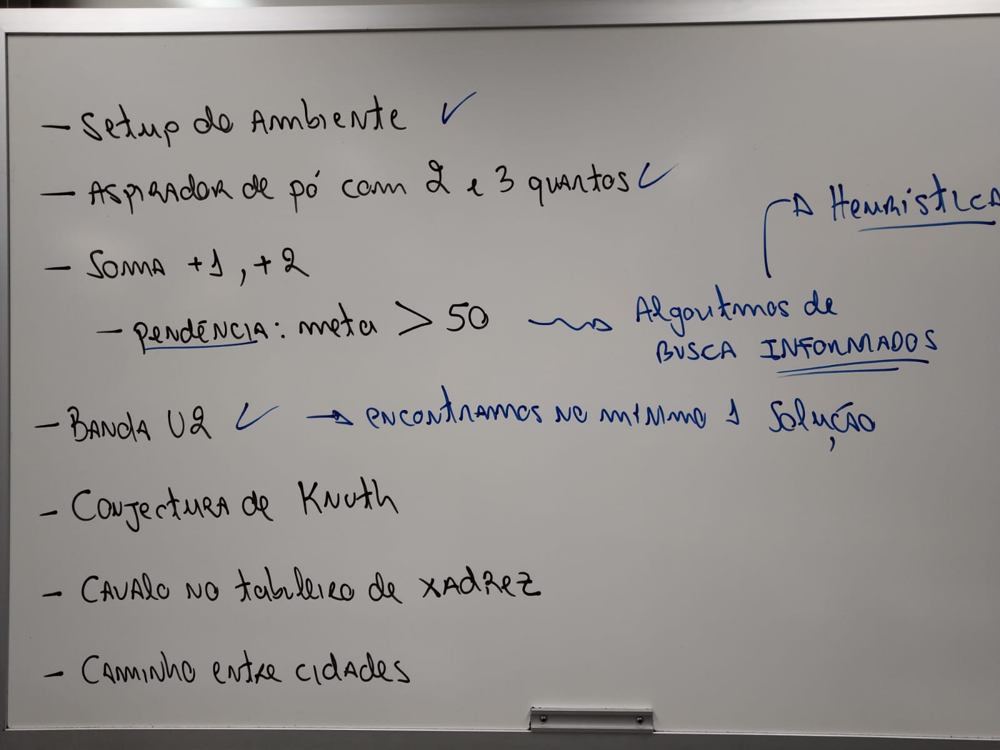

# Diário de bordo da disciplina

* 19/05: [Enunciado sobre o último projeto da disciplina](./enunciados/projeto_final_rl.md).

* 17/05: [Enunciado do projeto sobre Deep Q-Learning](./enunciados/projeto_deep_q_learning.md).

* [Material sobre Deep Reinforcement Learning](https://github.com/fbarth/reinLearn/blob/main/slides/deep_reinforcement_learning.md).

* Atividades para o dia 12/05: 
    * Treinar e avaliar o agente que atua no ambiente de BlackJack.
    * Treinar e avaliar o agente que atua no ambiente MountainCar.
    * Entender o conceito de Deep Q-Learning.
    * 

* 09/05 e 12/05: 
    * [Q-Learning e ambientes não-determinísticos](https://github.com/fbarth/reinLearn/tree/main/src/parte3/parte3.md)
    * [Q-Learning e jogos com variável aleatória](https://github.com/fbarth/reinLearn/tree/main/src/parte4/parte4.md)
    * [Discretizando o espaço de estados](https://github.com/fbarth/reinLearn/tree/main/src/parte5/parte5.md)
    * 

* 05/05: [Material sobre Aprendizagem por reforço](https://github.com/fbarth/reinLearn):
    * Os slides estão disponíveis em [https://github.com/fbarth/reinLearn/blob/main/slides/reinforcementLearning.pdf](https://github.com/fbarth/reinLearn/blob/main/slides/reinforcementLearning.pdf).
    * Os códigos estão disponíveis em [https://github.com/fbarth/reinLearn/tree/main/src](https://github.com/fbarth/reinLearn/tree/main/src).
    * 

* 02/05: [Resultados da competição de Connect4 com variante popout](./code/games/fourinrow_popout/results/Resultados.md). 

* 28/04: Competição de Connect4 variante com popout. Não esquecer de submeter código e documentação até às 15 horas do dia 28/04.  

* Implementação de um agente para ambiente competitivo:
    * [Enunciado da implementação](./enunciados/implementacao_busca_competitiva.md).

* Material sobre Busca Competitiva:
    * [Material principal e atualizado](http://fbarth.net.br/Connect4-Python/).
    * [Implementações sobre Busca Competitiva neste repositório](./code/games/README.md).
    * [Referência secundária](./slides/04_busca_competitiva/buscaCompetitiva.pdf).

* 05/04 (semana de provas):
    * as entregas do exercício número 2 (8 puzzle) foram feitas. A avaliação das entregas será feita ao longo da semana, com apresentação de uma possível solução no dia 12/4. 
    * a data limite para entrega do exercício número 3 (taxi driver) foi postergada para o dia 11/4 (segunda-feira), como combinado em sala de aula. 
    * no dia 12/4 vamos iniciar o conteúdo sobre agentes autônomos atuando em ambiente competitivo. 

* 24/03: agenda para os próximos dias: 
    * 24/03: entrega do exercício número 1;
    * 29/03: correção do exercício número 1 e espaço para desenvolvimento do exercício 2;
    * 31/03: entrega do exercício número 2. Não teremos aula neste dia pois é período de avaliações intermediárias;
    * 05/04: não tem aula neste dia - período de avaliações intermediárias;
    * 07/04: entrega do exercício número 3;
    * 12/04: correção dos exercícios número 2 e 3. Início do conteúdo sobre busca competitiva.

* [Link para lista de projetos](./enunciados/implementacoes_busca_parte3.md)

* 15/03: Neste dia discutimos o problema das 8-Rainhas e as suas possíveis soluções. Em [code/search/N_QueensProblem.py](./code/search/N_QueensProblem.py) é apresentado uma possível solução para o problema. No entanto, durante a aula foram identificadas algumas melhoras que poderiam ser aplicadas na geração do estado inicial e na geração dos sucessores a fim de reduzir o espaço de busca. Sugiro implementar tais melhorias no código e testá-las. 

* 15/03: Objetivos da aula de hoje:

    * Discutir e analisar pendências ou dúvidas sobre os exercícios implementados até então;
    * **Discutir o problema das oito rainhas**. Material de referência: [slides sobre algoritmos de busca informados: 42-47](./slides/03_algoritmos_busca/busca_versaoFabricio.pdf);
    * **Iniciar a discussão sobre os enunciados dos problemas que precisam ser entregues nas próximas semanas e que irão valer nota**.

* 10/03: Status sobre os problemas discutidos em sala de aula e novos problemas:

    * Aspirador de pó com 2 e 3 quartos: espera-se que **TODOS** tenham entendido e implementado a solução;
    * Soma +1 e +2: espera-se que **TODOS** tenham entendido e implementado a solução, inclusive utilizando o conceito de heurística;
    * Banda U2: espera-se que **TODOS** tenham entendido a solução;
    * Conjectura de Knuth: espera-se que **TODOS** tenham entendido o problema e **ALGUNS** sofrendo com detalhes de implementação;
    * Cavalo no tabuleiro de Xadrez: foram adicionadas algumas referências que talvez possam ajudar no desenvolvimento da solução;
    * Caminhos entre cidades: este é fácil de implementar. Já discutimos em sala de aula. Precisa implementar com heurística, apesar do exemplo ter
    um espaço de busca pequeno. Tem alguns detalhes sobre leituras de arquivos e algumas estruturas de dados um pouco mais complexas (grafos)
    que talvez gere um esforço adicional;
    * Problema das oito rainhas: este é **NOVO**. Quando chegar nele me avisa! 
    * 

* 08/03: Discutir o conceito de heurística ([do slide 32 até 41](./slides/03_algoritmos_busca/busca_versaoFabricio.pdf)) 
e algoritmos de busca informados visando resolver os problemas em aberto 
do [enunciado 1](./enunciados/implementacoes_busca_parte1.md) e no [enunciado 2](./enunciados/implementacoes_busca_parte2.md). Problemas discutidos:
    * Aspirador de pó com 2 e 3 quartos;
    * Soma +1 e +2;
    * Banda U2;
    * Conjectura de Knuth;
    * Cavalo no tabuleiro de Xadrez;
    * Caminhos entre cidades;
    * 
 
* 03/03: Vamos continuar o problema da banda U2 e conjectura de Knuth. Resumo do dia: 

Tem código novo no projeto! Melhor fazer um *git pull*.

* 24/02: Vamos começar a implementar soluções para alguns problemas clássicos de otimização, roteamento e planejamento. O enunciado com as questões está neste [arquivo](./enunciados/implementacoes_busca_parte1.md). Fizemos os exercícios do aspirador de pó, aspirador de pó com 3 quartos, soma 1 e soma 2 com explicação sobre heurística.

* 22/02: Vimos como definir um problema usando espaço de busca (estados, transições, estado meta e custo) [[referência]](slides/03_algoritmos_busca/busca_versaoFabricio.pdf). Relembramos o funcionamento dos algoritmos de Busca em Largura e Profundidade. Vimos os algoritmos Busca em Profundidade Iterativo e Busca de custo uniforme. Também analisamos tais algoritmos considerando os critérios: completo, ótimo, tempo, espaço. 

* 17/02: Vamos definir melhor o que é [agente autônomo e ambiente](slides/02_agentes_autonomos/agentes_autonomos.pdf). E provavelmente vamos começar a ver uma das formas que podemos utilizar para [modelar e implementar agentes autônomos](slides/03_algoritmos_busca/busca_versaoFabricio.pdf). 
    * [What's the status of self-driving cars? There has been progress, but safety questions remain.](https://www.cbsnews.com/news/self-driving-cars-status-progress-technology-safety/)

* 15/02: Apresentação dos objetivos, dinâmica e materiais da disciplina. Discussão sobre o que é [IA e a relação com agentes autônomos](slides/01_introducao_ia/introducao_ia.pdf). Além das referências já disponibilizadas no material, também foram discutidas outras referências, entre elas:
    * [Game over: Kasparov and The Machine, 2003](https://www.imdb.com/title/tt0379296/)
    * [Deep Blue - Down the Rabbit Hole](https://www.youtube.com/watch?v=HwF229U2ba8): um vídeo um tanto quanto interessante sobre o assunto com vários detalhes que são difíceis de encontrar em outras fontes. 
    * [AlphaGo - The Movie, 2020](https://www.youtube.com/watch?v=WXuK6gekU1Y)
    * [Game Changer: AlphaZero's Groundbreaking Chess Strategies and the Promise of AI, 2019](https://www.amazon.com.br/dp/B07N6G7X5V)
    * [Assessing Game Balance with AlphaZero: Exploring Alternative Rule Sets in Chess](https://arxiv.org/abs/2009.04374)  